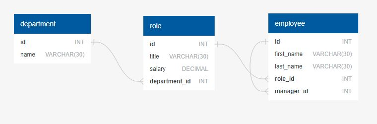

  # HR System (Project Jubilant Octo Spork)

  ## Table of Contents
  - [Description](#Description)
  - [Usage](#Usage)
  - [Installation](#Installation)
  - [License](#License)
  - [Contributing](#Contributing)
  - [Tests](#Tests)
  - [Questions](#Questions)

  ## Description
  This project is an employee managment system that os command line based.  It uses node.js, mysql and inquirer.

  ## Usage
  To use this app you will need to install mysql, download or clone the GitHub repository, use the schema.sql and seeds.sql to build and seed the database. Then, in a terminal in the app directory, type npm i to install the libraries needed, then type node server.js to start the app. use the arrow keys and enter to navigate the menus.

  ## Installation
  Install mysql, download or clone the repository, use the files in the db directory to build and seed the database, then you can run the app by typing node server.js in a terminal from the apps directory.

  ## Questions
  ctowns5

  ## Contributing
  NA

  ## Tests
  NA

  ## License
  Licensed under the [MIT](https://opensource.org/licenses/MIT) license
  

  ### Database diagram and screenshots of the app running
  
  
  
  
  
  ## link to GitHub Repository: https://github.com/ctowns5/jubilant-octo-spork

  ## link to walkthrough video: 
  
